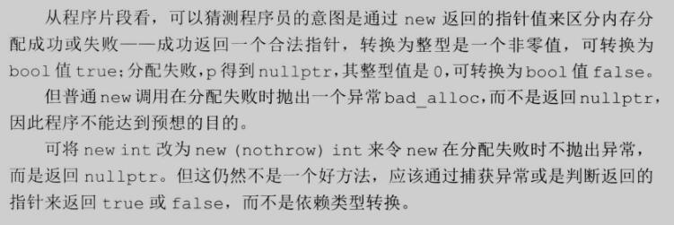
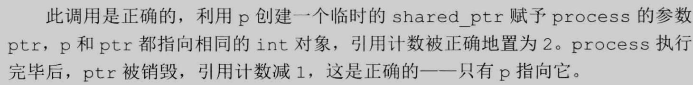

# 第十二章 动态内存

## 练习12.0

> 简单介绍一下静态内存和堆栈

### 出题思路

- 理解内存管理。
 
### 解答

> Our programs have used only static or stack memory. `Static memory` is used for local static objects (§ 6.1.1, p. 205), for class static data members (§ 7.6, p. 300), and for variables defined outside any function.

> `Stack memory` is used for non-static objects defined inside functions. (refer to the implementation of functions)

> Objects allocated in `static` or `stack memory` are automatically created and destroyed by the compiler. `Stack objects` exist only while the block in which they are defined is executing; `static objects` are allocated before they are used, and they are destroyed when the program ends.

> In addition to static or stack memory, every program also has a pool of memory that it can use. This memory is referred to as the `free store` or `heap`. Programs use the heap for objects that they dynamically allocate—that is, for objects that the program allocates at run time. The program controls the lifetime of dynamic objects; our code must explicitly destroy such objects when they are no longer needed.

## 练习12.3

> `StrBlob` 需要`const` 版本的`push_back` 和 `pop_back`吗？如需要，添加进去。否则，解释为什么不需要。

### 解答

> 不需要。`push_back` 和 `pop_back` 会改变对象的内容。而 `const` 对象是只读的，因此不需要。

## 练习12.4

> 在我们的 `check` 函数中，没有检查 `i` 是否大于0。为什么可以忽略这个检查？

### 出题思路

- 理解私有成员函数和公有成员函数的差别。

### 解答

- check 被定义为私有成员函数，只会被 StrBlob 的成员函数调用，而不会被用户程序调用。故我们很容易保证传递给它的值 i 值符合条件，故不必检查。
  
## 练习12.8

> 下面的函数是否有错误？如果有，解释错误原因。

### 出题思路

- 理解 new 分配内存成功和失败的区别，以及复习类型转换。

```cpp
bool b() {
	int* p = new int;
	// ...
	return p;
}
```

### 解答



## [练习 12.9](ex12_09.cpp)

## 练习12.10

> 下面的代码调用了第413页中定义的`process` 函数，解释此调用是否正确。如果不正确，应如何修改？

```cpp
// ptr is created and initialized when process is called
void process(shared_ptr<int> ptr)
{
// use ptr
} // ptr goes out of scope and is destroyed

shared_ptr<int> p(new int(42));
process(shared_ptr<int>(p));
```

### 解答

> The parameter to process is passed by value, so the argument to process is copied into ptr. Copying a shared_ptr increments its reference count. Thus, inside process the count is at least 2. When process completes, the reference count of ptr is decremented but cannot go to zero. Therefore, when the local variable ptr is destroyed, the memory to which ptr points will not be deleted.



## Exercise 12.12

> Using the declarations of p and sp explain each of the following calls to process. If the call is legal, explain what it does. If the call is illegal, explain why:

```c++
auto p = new int();
auto sp = make_shared<int>();
(a) process(sp);
(b) process(new int());
(c) process(p);
(d) process(shared_ptr<int>(p));
```

### Answer 12.12

- (a) 合法，sp 是一个共享指针。不存在内存泄漏和空悬指针问题。

- (b) 合法，new 创建一个 int 对象，指向它的指针被用来创建一个 shared_ptr.
 
- (c) 不合法. 不能将普通指针 *int 转换为 shared_ptr.
 
- (d) 合法，但是错误的程序。普通指针 p 在 process 执行完毕后，会变成一个空悬指针。

## Exercise 12.13

> What happens if we execute the following code?

```c++
auto sp = make_shared<int>();
auto p = sp.get();
delete p;
```

### Answer 12.13

- p 释放了 sp 指向的地址，但引用次数仍为 1，sp 成为了一个空悬指针。

## Exercise 12.17

> Which of the following unique_ptr declarations are illegal or likely to result in subsequent program error? Explain what the problem is with each one.

```c++
int ix = 1024, *pi = &ix, *pi2 = new int(2048);
typedef unique_ptr<int> IntP;
(a) IntP p0(ix);
(b) IntP p1(pi);
(c) IntP p2(pi2);
(d) IntP p3(&ix);
(e) IntP p4(new int(2048));
(f) IntP p5(p2.get());
```

### Answer 12.17

- (a) 不合法，unique_ptr 需要指针初始化，int 无法转换为指针。

- (b) 合法，但程序是错误的，当 p1 销毁时会释放内存， 其行为将是未定义的。

- (c) 合法，pi2 为一个动态对象的指针，用它来初始化 unique_ptr 是没问题的。

- (d) 合法，但存在 b 的问题。

- (e) 合法，与 c 类似。

- (f) 合法，但造成 p2 和 p5 指向相同的地址，当其中一个释放对象时，另一个指针将成为空悬指针。

## Exercise 12.18

> Why doesn’t shared_ptr have a release member?

### Answer 18

- unique_ptr 拥有独占对象的特性，当需要对象的所有权转移给另一个 unique_ptr 时，使用 release；但 shared_ptr 可通过拷贝和赋值操作转移使用权，故不需要 release。

